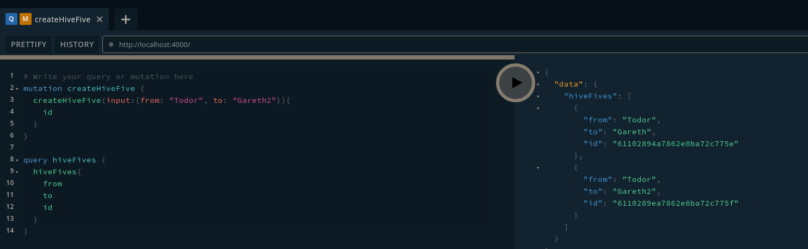
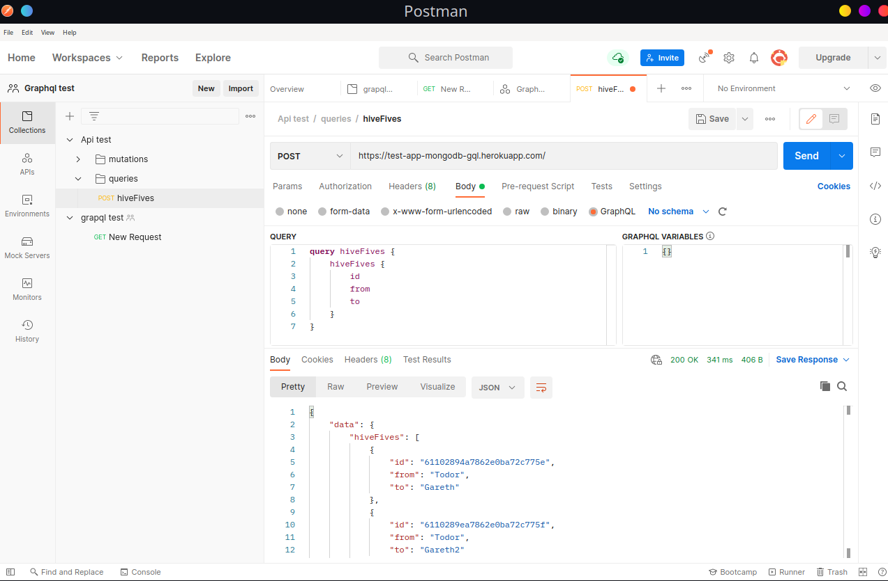

# GraphQL API Example

The source code for my article on creating and deploying a GraphQL API.

https://medium.com/swlh/build-and-deploy-a-scalable-graphql-api-d912df6b7c28


## Run Local Server

```
yarn install
yarn start
```

## Try subscription and mutation in Graphql Playground or postman

```
# Write your query or mutation here
mutation createHiveFive {
  createHiveFive(input:{from: "Todor", to: "Gareth2"}){
    id
  }
}

query hiveFives {
  hiveFives{
    from
    to
    id
  }
}
```

<p align="center">
  
</p>


Postman url (Heroku)

```
https://test-app-mongodb-gql.herokuapp.com/
```

<p align="center">
  
</p>